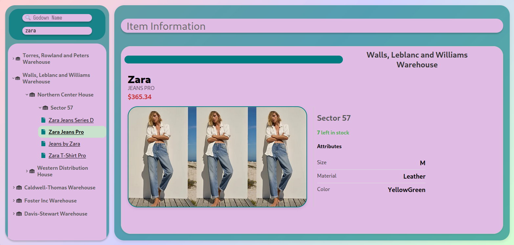
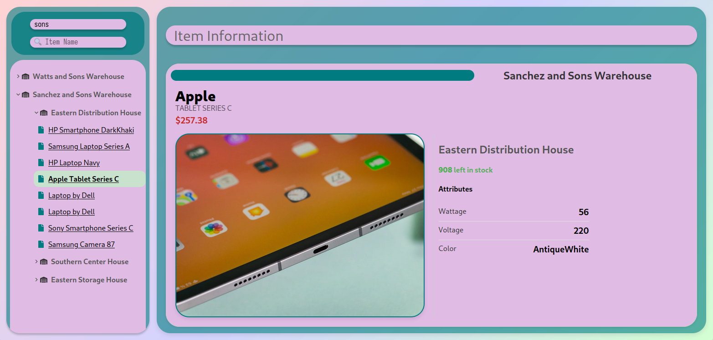

# Development Process (so far)

1. Transforming the data into a tree structure
1. Creating the tree components
1. Enable selecting Items
1. Display Item details
1. Search feature (godowns)
1. JWT Authentication for Login
1. Dockerise
1. Add search by item
1. Move data to backend
1. Style everything

# Screenshots





# Development

You can execute 
```
git clone https://github.com/Majestic9169/interiit-tree.git
cd interiit-tree/
docker-compose up --build
```

To run the entire app once

the login credentials are 
```
email: tegan@tegan
password: interiit
```

### Frontend

**ReactJS with typescript**

To develop the frontend you can `cd` into the `tree-app-frontend/` directory and run 
```
npm install
npm start
```
to start the development server

### Backend

**ExpressJS**

`cd` into the `tree-app-backend/` directory and run 
```
npm install
node server.js
```

# Deployment

1. The frontend and backend been dockerised with docker-compose
1. I have applied for the Github student developer's pack for my free credits to manually deploy this app, however I did have not received a reply yet. The moment I get my credits I will manually deploy  this app.

# Issues Faced

1. I was visiting family during this Durga Puja vacation and thus could not give as much time as I would have liked to this project. You can go through my commit history to see that I was able to devote a proper amount of time only on the first day
1. Because I was not at college during the vacation, I was rejected by Github for their Student Developer's pack since they couldn't verify it. I have applied again today (Sunday) and have not received a response yet, preventing me from manually deploying my app
1. Namely in styling, I faced several issues.
    1. The Tree Panel at the left for some reason does not completely cover all the children of the tree. When I expand my tree very much, the background is unable to cover the children, and I don't understand why.
    1. I had a lot of trouble trying to get the search bar to fixed in position so that it will always be visible, but I couldn't get the exact values needed to keep it at those coordinates, and couldn't implement this.
    1. The image in the items display is currently being "cropped" to fit in the frame I created for it. 


# Looking Forward

Due to the time crunch, I decided it was best to create functional frontend and deploy the app before tweaking it further. However due to the reasons listed above I was unable to deploy my app. Nevertheless there are many things I want to improve

### Frontend: 
- [x] I need to create a proper component to display item details, so far only name and image are displayed. 
- [x] I can add another search bar for searching by item, very similar to the current one for searching by godown.
- I could add an expand-all/collapse-all button
- [x] Everything can be styled better 
- The JWT Token is currently stored in `sessionStorage` which is not very secure. I have to look into storing it as a cookie
- I have not looked into drag-and-drop yet, but given time I would like to add that
- A statistics panel would also be great, but I don't think I have time for that at all

### Backend: 
- [x] Backend was added very late, and only for the purpose of authentication using JWT. But since the godown/item data is currently living in the frontend this is very useless. So the next step is to move our JSON data to the backend server.

